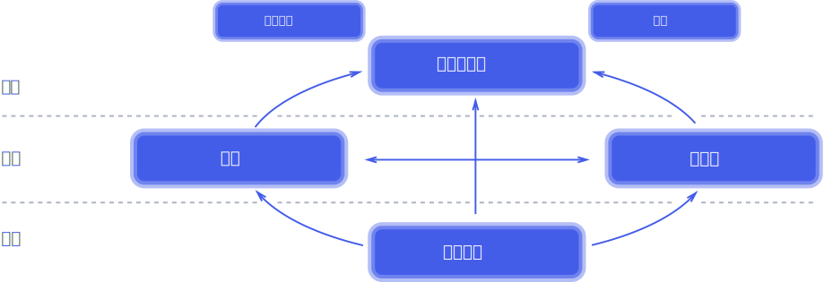

## 响应式系统主流框架
- akka  
使用Scala语言开发，后期支持Java，但是在Java社区并不如从前受欢迎
- Vert.x  
Vert.x是Eclipse发行的开源项目，设计初衷是作为Node.js在Java虚拟机上的替代方法，支持非阻塞和事件驱动，在近几年开始受大家关注
- Project Reactor  
Spring5中默认引入的响应式编程机制，出现的比较晚，所以也吸收了前辈的经验。
- RxJava  
ReactiveExtensions，早起应用于.net平台

## 响应式与命令式的区别


## 响应式宣言
https://www.reactivemanifesto.org/



即时响应性（Responsive）、回弹性（Resilient）、弹性（Elastic）以及消息驱动（Message Driven)

- 特点
  - 即时响应性  
  只要有可能， 系统就会及时地做出响应。 即时响应是可用性和实用性的基石， 而更加重要的是，即时响应意味着可以快速地检测到问题并且有效地对其进行处理。 即时响应的系统专注于提供快速而一致的响应时间， 确立可靠的反馈上限， 以提供一致的服务质量。 这种一致的行为转而将简化错误处理、 建立最终用户的信任并促使用户与系统作进一步的互动。

  - 回弹性  
    系统在出现失败时依然保持即时响应性。 这不仅适用于高可用的、 任务关键型系统——任何不具备回弹性的系统都将会在发生失败之后丢失即时响应性。 回弹性是通过复制、 遏制、 隔离以及委托来实现的。 失败的扩散被遏制在了每个组件内部， 与其他组件相互隔离， 从而确保系统某部分的失败不会危及整个系统，并能独立恢复。 每个组件的恢复都被委托给了另一个（外部的）组件， 此外，在必要时可以通过复制来保证高可用性。 （因此）组件的客户端不再承担组件失败的处理。

  - 弹性  
    系统在不断变化的工作负载之下依然保持即时响应性。 反应式系统可以对输入（负载）的速率变化做出反应，比如通过增加或者减少被分配用于服务这些输入（负载）的资源。 这意味着设计上并没有争用点和中央瓶颈， 得以进行组件的分片或者复制， 并在它们之间分布输入（负载）。 通过提供相关的实时性能指标， 反应式系统能支持预测式以及反应式的伸缩算法。 这些系统可以在常规的硬件以及软件平台上实现成本高效的弹性。

  - 消息驱动  
    反应式系统依赖异步的消息传递，从而确保了松耦合、隔离、位置透明的组件之间有着明确边界。 这一边界还提供了将失败作为消息委托出去的手段。 使用显式的消息传递，可以通过在系统中塑造并监视消息流队列， 并在必要时应用回压， 从而实现负载管理、 弹性以及流量控制。 使用位置透明的消息传递作为通信的手段， 使得跨集群或者在单个主机中使用相同的结构成分和语义来管理失败成为了可能。 非阻塞的通信使得接收者可以只在活动时才消耗资源， 从而减少系统开销。


## 应用场景

- 电商中的响应式
- 富客户端（Gmail、qq邮箱）
- 系统通知
- 股市K线
- 聊天室

## 背压 Backpressure

在数据流从上游生产者向下游消费者传输的过程中，上游生产速度大于下游消费速度，导致下游的 Buffer 溢出，这种现象就叫做 Backpressure 出现

## Project Reactor  
官网 https://projectreactor.io/

Reactor 是Spring5中构建各个响应式组件的基础框架，内部提供了Flux和Mono两个代表异步数据序列的核心组件。

### Flux

### 静态方法生成

```java
// 静态方法生成Flux
	
	
	String[] s = new String[] {"xx","oo"};
	// just 已知元素数量和内容 使用
	// 
	Flux<String> flux1 = Flux.just(s);
//	flux1.subscribe(System.out::println);

	
	Flux<String> flux2 = Flux.just("xx","xxx");
//	flux2.subscribe(System.out::println);
	
	
	
    //fromArray方法
    List<String> list = Arrays.asList("hello", "world");
    Flux<String> flux3 = Flux.fromIterable(list);
  //  flux3.subscribe(System.out::println);
	
    
    //fromStream方法
    Stream<String> stream = Stream.of("hi", "hello");
    Flux<String> flux4 = Flux.fromStream(stream);
 //   flux4.subscribe(System.out::println);
    
    
    //range方法
    Flux<Integer> range = Flux.range(0, 5);
    
 //   range.subscribe(System.out::println);
    
  //interval方法, take方法限制个数为5个
    Flux<Long> longFlux = Flux.interval(Duration.ofSeconds(1)).take(5);
    longFlux.subscribe(System.out::println);
    
    //链式
    Flux.range(1, 5).subscribe(System.out::println);
}

```

```java
    //链式
   Flux.range(1, 5).subscribe(System.out::println);
   
   
   // 合并
   Flux<String> mergeWith = flux3.mergeWith(flux4);
   mergeWith.subscribe(System.out::println);
   System.out.println("---");
   
   // 结合为元祖
   Flux<String> source1 = Flux.just("111", "world","333");
   Flux<String> source2 = Flux.just("2111", "xxx");

   Flux<Tuple2<String, String>> zip = source1.zipWith(source2);
   zip.subscribe(tuple -> {
       System.out.println(tuple.getT1() + " -> " + tuple.getT2());
   });
```

```java
	// 跳过两个
    Flux<String> flux = Flux.just("1111", "222", "333");

    Flux<String> skip = flux.skip(2);
    skip.subscribe(System.out::println);
    
    // 拿前几个
    Flux<String> flux2 = Flux.just("1111", "222", "333");
    Flux<String> skip2 = flux2.take(2);
    skip2.subscribe(System.out::println);
   

	// 过滤
    Flux<String> flux = Flux.just("xx", "oo", "x1x");

    Flux<String> filter = flux.filter(s -> s.startsWith("x"));
    filter.subscribe(System.out::println);

	// 去重
    Flux<String> flux = Flux.just("xx", "oo", "x1x","x2x");

    Flux<String> filter = flux.filter(s -> s.startsWith("x")).distinct();
    filter.subscribe(System.out::println);
    // 转 Mono
    Flux<String> flux = Flux.just("xx", "oo", "x1x","x2x");
    Mono<List<String>> mono = flux.collectList();
    
    mono.subscribe(System.out::println);


    // 逻辑运算 all 与 any
    Flux<String> flux = Flux.just("xx", "oox", "x1x","x2x");

    Mono<Boolean> mono = flux.all(s -> s.contains("x"));
    mono.subscribe(System.out::println);
```

Mono 连接

```
  Flux<String> concatWith = Mono.just("100").concatWith(Mono.just("100"));
  
  concatWith.subscribe(System.out::println);
```

异常处理

```
  Mono.just("100")
      .concatWith(Mono.error(new Exception("xx")))
      
      .onErrorReturn("xxx")
      .subscribe(System.out::println)
```


### 动态创建

```java
		// 同步动态创建，next 只能被调用一次
		Flux.generate(sink -> {

			sink.next("xx");
			sink.complete();

		}).subscribe(System.out::print);
	}
```


```
		Flux.create(sink -> {
			
			for (int i = 0; i < 10; i++) {
				sink.next("xxoo:" + i);
			}
			
			sink.complete();
			
			
		}).subscribe(System.out::println);
	}
```


## WebFlux


## RXJava2

http://reactivex.io/#

**Reactive Extensions**

### 同步

哪个线程产生就在哪个线程消费

### 异步

| 方法                      | 说明                               |
| ------------------------- | ---------------------------------- |
| Schedulers.computation()  | 适用于计算密集型任务               |
| Schedulers.io()           | 适用于 IO 密集型任务               |
| Schedulers.trampoline()   | 在某个调用 schedule 的线程执行     |
| Schedulers.newThread()    | 每个 Worker 对应一个新线程         |
| Schedulers.single()       | 所有 Worker 使用同一个线程执行任务 |
| Schedulers.from(Executor) | 使用 Executor 作为任务执行的线程   |

## 响应式的Web服务  
### SpringMVC注解模式  
传统的SpringMVC注解与WebFlux通用，区别在于底层实现，一个是基于ServerHTTPRequest的另一个是基于HTTPServletRequest

### Router与Handler  
- RouterFunctions可以产生Router和Handler对象，

- RouterFunctions对标@Controller中的注解

- Router相当于@RequestMapping

- Handler相当于Controller中的方法

#### RouterFunctions中的Router

主要起到的功能是路由匹配URI，执行Handler中的逻辑

**指定Handler**

```
return RouterFunctions
        .route(RequestPredicates.GET("/06")
        .and(RequestPredicates.accept(MediaType.TEXT_PLAIN)), fluxHandler::getxx)
```

**直接返回**

```
return RouterFunctions
        .andRoute(RequestPredicates.path("/xxoo"),
                request -> ServerResponse.ok().body(BodyInserters.fromValue("xx")))
```

##### 多层匹配

指定的函数如果匹配不成功，则进入下一条规则，匹配顺序按照代码顺序执行

##### **Route规则**

可以使用Path+Method 或者使用Get、Post

### ServerRequest和 ServerResponse

- SpringMVC中使用的是HTTPServletRequest

- webFlux + SpringMVC 使用的是ServerHTTPRequest

- WebFlux+ 响应式 使用的是 ServerRequest

#### ServerRequest

##### 请求方式

请求方式与数据类型绑定在Router中

```java
 return RouterFunctions
            .route(RequestPredicates.GET("/01")
            .and(RequestPredicates.accept(MediaType.TEXT_PLAIN)), fluxHandler::getxx)
```

##### 获取请求参数

**使用request.queryParams()**

```
MultiValueMap<String, String> queryParams = request.queryParams();
```

**使用占位符**

request.pathVariable

```
.andRoute(RequestPredicates.GET("/03/{name}_{id}").and(RequestPredicates.accept(MediaType.TEXT_PLAIN)), fluxHandler::getxx2)
				
```

```
	public Mono<ServerResponse> getxx2(ServerRequest request){
		
		String name = request.pathVariable("name");
		String id = request.pathVariable("id");
		System.out.println("id:" + id);
		System.out.println("name:" + name);
		return ServerResponse.ok().contentType(MediaType.TEXT_PLAIN).body(BodyInserters.fromValue("xx"));
	}
```

#### ServerResponse

##### 返回JSON

```
		Person person = new Person();
		person.setId(1);
		person.setName("xx");
		return ServerResponse.ok().contentType(MediaType.APPLICATION_JSON).body(BodyInserters.fromValue(person));
```

返回404和其他

```
return ServerResponse.notFound().build();
```


## 一些操作符

### Operator

#### [flatmap](https://projectreactor.io/docs/core/release/api/reactor/core/publisher/Flux.html#flatMap-java.util.function.Function-)

**no operations occur until the stream is subscribed**, `flatMap` eagerly subscribes. The operator doesn't
wait for the publisher to finish before moving on to the next stream, meaning the subscription is non-blocking.

Since the pipeline handles all the derived streams simultaneously, their items may come in at any moment. As a
result, the original order is lost. If the order of items is important, consider using the [flatMapSequential](https://projectreactor.io/docs/core/release/api/reactor/core/publisher/Flux.html#flatMapSequential-java.util.function.Function-) operator
instead.

#### difference between map and flatMap

- 1.One-to-One vs. One-to-Many <br/>
  The `map` operator applies a **one-to-one** transformation to stream elements, while `flatMap` does **one-to-many**.
  Difference between method signature:

    - _<V> Flux<V> map(Function<? super T, ? extends V> mapper)_ – the mapper converts a single value of type T to a single value of type V
    - _Flux<R> flatMap(Function<? super T, ? extends Publisher<? extends R>> mapper)_ – the mapper converts a single value of type T to a Publisher of elements of type R

- 2.Synchronous vs. Asynchronous <br/>
  Here are two extracts from API specification:

    - **_map_**: Transform the items emitted by this Flux by applying asynchronous function to each item
    - **_flatMap_**: Transform the elements emitted by this Flux asynchronously into Publishers

  It's easy to see **map is a synchronous operator** – it's simply a method that converts one value to another. This method executes in the same thread as the caller.

  The other statement – **flatMap is asynchronous** – is not that clear. In fact, the transformation of elements into Publishers can be either synchronous or asynchronous.
